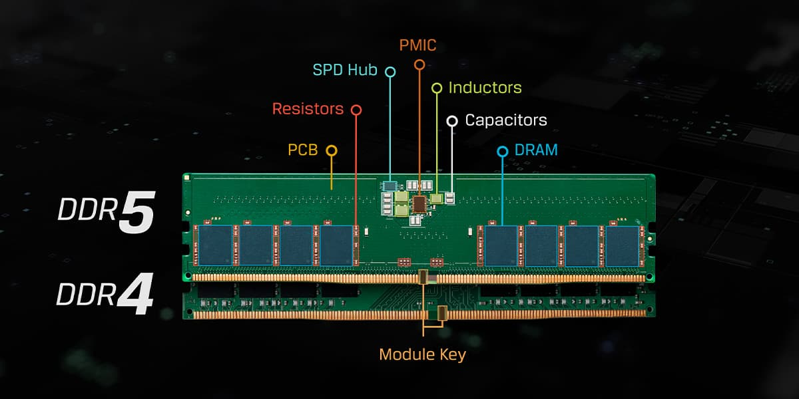

开个玩笑~

事情的缘由是，最近笔记本坏了，鉴于手里已经有一台 Surface 了，所以考虑组装一个台式机，作为小白，人生第一次完整装机，记录一下过程。

## 预算

- 预算：7000~9000元，不包括显示器、键鼠、耳机；
- 生命周期：>=4年即可；

基本结论：这台主机不会用太久，所以配置不求最新，能省则省。

## 明确需求

- 性能需求：日常文档处理、浏览网页、音乐、视频、基本游戏需求需要满足，不常玩3A大作；有跑ai模型的学习需求，常用开发工具不能出现卡顿；
- 稳定性需求：要求低故障率，不会爆炸；
- 外观需求：风格一致即可，不需要RGB灯光，无颜色偏好；

基本结论：关键配件选择一线品牌，非关键配件尽量高性价比，按照 **无光黑色** 风格搭配即可。

## 型号调研

需要购置的配件有：CPU、主板、内存、硬盘、显卡、机箱、电源、散热器、风扇；

### CPU

身为程序员，果然还是更倾向于Intel。关于Intel CPU的详细命名规则，在英特尔官网有写：[英特尔® 处理器名称和编号](https://www.intel.cn/content/www/cn/zh/processors/processor-numbers.html)。对于桌面端消费级CPU，知道`13600`中`13`代表“代数”，`600`代表子型号（SKU），`F`后缀代表无核显，`K`后缀不锁倍频就够了。

目前最新一代CPU为2022年10月发布的13代，一般SKU越大性能越好。由于不求新，就同时比较12代和13代，但是我需要核显。热门的几款型号分别是：

i5 13400、i5 13490、i5 12600(k)、i5 12700(k)、i5 13600(k)、i5 13700(k)

它们的性能依次递增，价格也一样。其中我最关注的是12600(k)和13600(k)，看了参数和评测，发现13600除了核心频率提高了之外，相比12600主要是增加了4给小核，以及缓存变大了很多。还有一点需要提到的是，市面上有一种称为“散片”的CPU，没有正规包装，但是价格会便宜一点。

思考了很久，感觉这台主机不会用太长时间，所以最终选择了12600k，性能足够，价格更便宜。选择带k的CPU是因为，非k后缀的CPU锁SA电压，内存在Gear1模式下很难超过3200mhz的频率。

### 主板

不玩超频，倾向matx版型，可供选择的芯片组有b660、b760这两代。b760相比b660主要是增加了PCIe4.0接口的数量。需要注意不同ddr代数的主板不能混用，内存条接口都不一样。

为了贯彻能省则省的原则，直接考虑12代板U。本人暂时不认为现阶段ddr4和ddr5内存在工作的体验上有质的飞跃，所以主板就选了微星的b660m mortar ddr4 wifi，这样就可以省下一点钱。不过这款主板有个max版本，可以超外频，只需要加50RMB，后来就换了这个尝鲜。

### 内存

需要匹配主板的ddr4内存条，不要灯光，不超频，市面上可选产品很多，考虑到本人经常同时开很多网页和软件，最终选择的宏碁凌霜 3600 C18 16G *2。

### 硬盘

宏碁GM7 4TB只需要999！长存颗粒，看着是真香。不过我最终选择了另外一个，宏碁GM7000 2TB，这个带2G的DRAM缓存，京东价格599。

### 显卡

预算有限，不能上4080、4090这样的高端显卡了，我决定买一个显存大一点的，好能跑得动一些吃显存的模型。但是找来找去，只有RTX 4060ti 16G这种答辩，在显存频率没有太大提升的情况下，显存位宽砍半，仅有128bit，导致显存带宽大打折扣，便宜一点的和贵一点的显卡都没有大显存，二手3090怕矿卡不敢买，无奈呀。

最后买了影驰金属大师RTX 4060ti 16G MAX OC，性价比不是很高，不过是跟无光黑色机箱倒是挺搭的。

### 机箱

海景房就算了，过一年还要搬家，怕碎，其他能装matx主板就行。于是跟风！选了乔思伯松果D31 mesh板。

### 散热器

跟风！酷里奥P60T 性能版 纯黑色，双塔风冷散热器。听说噪声小、性能很棒。

### 风扇

随便选了利民G12*3+利民S12，后者带一圈灯环，还是有一点点灯光的。实际上风扇是我最后买的，在此之前其他配件都到齐了，我发现即使只装一个风冷也能完美使用，所以风扇就没配全。

PS: 这套风扇真是一言难尽，静音确实是静音，但是没多少风量，早知道不如买更便宜的C12C。

### 电源

可选项很多，网上关于谁好谁坏的争论也很多，综合考虑下，我买了利民TG650 650w金牌全模组，五年质保，主要是价格便宜（汗）。

## 配置总结

发现拼多多上某些硬件好便宜，遂从拼多多入手大多数配件，最终配置单如下。

| 配件   | 型号                               | 渠道   | 入手价（元） |
| ------ | ---------------------------------- | ------ | ------------ |
| CPU    | Intel Core i5 12600k 散片          | 拼多多 | 1405         |
| 主板   | 微星 b660m mortar max wifi ddr4    | 拼多多 | 917          |
| 内存   | 宏碁掠夺者凌霜 3600 C18 16G *2     | 拼多多 | 454          |
| 硬盘   | 宏碁掠夺者 GM7000 2TB              | 拼多多 | 593          |
| 显卡   | 影驰 RTX4060ti 金属大师 16G MAX OC | 淘宝   | 3689         |
| 散热器 | 酷里奥 P60T 性能版 黑色            | 拼多多 | 247          |
| 机箱   | 乔思伯松果 D31 黑色 mesh版         | 拼多多 | 195          |
| 风扇   | 利民 G12 \*3 + 利民 S12 黑色 \*1   | 拼多多 | 86           |
| 电源   | 利民TG650 650w金牌全模组           | 京东   | 316          |
| 总计   |                                    |        | 7902         |

这其中不少配件还能再缩水，恐怕还能挤出几百块来😂。

## 成品展示

参照b站教程： [【装机教程】全网最好的装机教程，没有之一](https://www.bilibili.com/video/BV1BG4y137mG/)

繁琐的过程就省略了，展示一下成果吧。

主打一个硬朗风格。装好后，CPU和内存我都尝试了超频，不得不说，超不了多少，体质是真一般，不过无所谓了。Enjoying~

## 后记

2023.10.3 淦，4060ti 16g 最低价被干到了3099，亏麻了。

2023.10.6 SSD涨了200块，我貌似刚好赶在涨价钱入的手。
