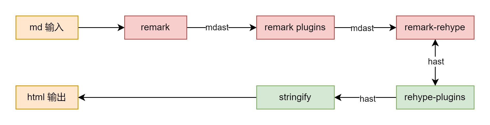

!!! info 注意
    这篇文章仅适用于基于 [remark.js](https://github.com/remarkjs/remark) 的 Markdown ，如 Astro.js、Gatsby.js 等等。如果你正在使用 MDX 那么该文章可能也适用于你。

嗨，今天我们来聊一下怎么给 Markdown 扩展新语法吧。这篇文章是本教程的上篇，在这篇里你将会看到如何通过编写扩展的方法，给 remark.js 添加自定义的语法支持。

请注意，该文章中涉及到的内容将不限于**JavaScript/TypeScript编程**、**编译原理**、**胡言乱语**、**灌水**以及**味同嚼蜡的流水账**，如果您有任何不适，请及时停止阅读。

## 起因

Markdown 是一个非常实用便捷的富文本标记语言，但是 CommonMark 支持的语法毕竟是有限的，为了拓展 Markdown 的功能，不同平台通常会支持创建一些自定义标签，例如 `...`。这种标签功能极大程度上丰富了 Markdown 的生态，但是遗憾的是，这些拓展功能通常与平台绑定。你可以看到，这个站点目前使用了基于 remark 的 Markdown 解析器，通过编写 remark 插件，我们可以拓展 Markdown 语法，来实现一些自定义的功能。

remark 解析器常见于一些站点生成器上，如 Gatsby.js、Astro.js 等等。同时，它也是 MDX 的核心解析器。既然谈到了 MDX，你可能会问”为什么不直接用MDX呢？”。Well，我认为，在非动态内容上使用 MDX 是一种冗余，除非真的有交互需求。还有一点是，Vscode 下 MDX 语法高亮插件好像不太聪明的样子……

## remark 技术栈

开始之前，我们先来了解一下，为了实现一个新语法，我们应该知道什么。

### remark 的执行机制

remark 实际上是 unified.js 的一个插件，一串 Markdown 文本需要经过如下流程才能被解析为 HTML：·



MDAST 是 remark产生的语法树，在得到 MDAST 后需要使用 remark-rehype 插件将 MDAST 转换为 HAST，也就是 rehype 这个插件（用来解析HTML 的 unified 插件）的语法树。这样我们就能接驳 rehype 的生态，并输出 html。当然，文章不涉及 rehype 的生态。

我们把重点放在 remark 如何解析输入为语法树。有一些重点需要说明：

1. remark 底层使用了 micromark 解析 markdown 语法为 token；
2. remark 使用了 mdast-util-from-markdown 插件辅助将 token 序列 转换为 MDAST;
3. micromark 和 mdast-util-from-markdown 均支持编写 extension；

关于这套工具链的流程，[discussion](https://github.com/orgs/remarkjs/discussions/869#discussioncomment-1602674) 中的回答可能会帮助你理解。

```plaintext
1. Input            | .~~~~ ['#','F','o','o','EOL'] <~~~ file.md
                    | |
2. Tokenize         | `~~~~ micromark(string)~~~~~~~~~~~~~~~~~~~~~~~~~~~~~~~~~~.
                    |                                                          o)-- micromarkExtension()
3. Token Stream     | .~~ ['enter:atxHeading','F','o','o','exit:atxHeading'] ~~'
                    | |
4. Grow Syntax Tree | `~~~> mdast-util-from-markdown(tokens) ~~~~~~~~~~~~~~~~~~.
                    |                                                 o        o)-- fromMarkdownExtension()
5. Transform Tree   | .~~~~~ transform(treeNode) => treeNode ~~~~~~~ / \  ~~~~~'
                    | |                                             o   o
6. Serialize        | `~~~~ mdast-util-to-markdown(tree) ~~~~~~~~~~~~~~~~~~~~~~.
                    |                                                          o)-- toMarkdownExtension()
7. Output           | <~~~~ ['#','F','o','o','EOL'] <~~~~~~~~~~~~~~~~~~~~~~~~~~'
```

### 如何编写一个 Rrmark 扩展

为了编写一个完整的语法扩展，我们需要做的事情有

1. 编写一个 micromark 扩展；
2. 编写一个 mdast-util-from-markdown 扩展；
3. 编写一个 remark 扩展；

嗯，也行你会注意到，micromark 似乎是用来做词法分析的，而 mdast-util-from-markdown 是用来做语法分析的。确实如此，不过之后的内容可能与你在课堂上学的内容有所不同。

## micromark 扩展

### 函数式状态机

问：micromark 如何 tokenize markdown 语法的文本呢？\
答：当然是**状态机**啦，不过这个状态机在我看来，应该是一个 NFA 而不是 DFA，而且写法上是函数式的。函数式状态机写法并不多见，但 [golang 的词法分析器](https://go.dev/src/text/template/parse/lex.go#L228) 就用了这种模式。

函数式的状态机大概有如下方式编写：

```js
function state_1(code) {
    if (code === 'a') return state_1;
    return state_2;
}
function state_2(code) {
    if (code === 'b') return state_2;
    return state_1;
}
```

表示一个这样的状态机


函数表示一个状态，并且返回一个函数，表示下一个状态，状态的转换逻辑写在函数内部，也就是说，状态转换关系是隐式的（implicit）。
状态函数通过一个循环不断调用，直到遇到终止状态。大概长这个样子

```js
state = initial_state;
while (!end_state) {
    state = state(code);
}
```

在 micromark 中，状态的[typescript 类型定义](https://github.com/micromark/micromark/blob/4346e010d537b05f622e636d001bd25c1140f6a1/packages/micromark-util-types/index.d.ts#L353)如下：

```ts
/**
 * A character code.
 *
 * This is often the same as what `String#charCodeAt()` yields but micromark
 * adds meaning to certain other values.
 *
 * `null` represents the end of the input stream (called eof).
 * Negative integers are used instead of certain sequences of characters (such
 * as line endings and tabs).
 */
export type Code = number | null
/**
 * The main unit in the state machine: a function that gets a character code
 * and has certain effects.
 *
 * A state function should return another function: the next
 * state-as-a-function to go to.
 *
 * But there is one case where they return void: for the eof character code
 * (at the end of a value).
 * The reason being: well, there isn’t any state that makes sense, so void
 * works well.
 * Practically that has also helped: if for some reason it was a mistake, then
 * an exception is throw because there is no next function, meaning it
 * surfaces early.
 */
export type State = (code: Code) => State | void
```

### 编写一个 tokenizer

问：micromark 的 tokenizer 怎么编写？\
答：tokenizer 是一个函数，你需要在 tokenizer 中编写需的状态函数，然后返回初始化状态函数。tokenizer 函数提供了一个 effects 参数，用来表示状态函数的副作用，例如创建 token、读取下一个字符，以及一个 ok 和 nok 参数，用来结束状态机。

问：micromark 中如何创建 token？\
答：首先需要知道的是，micromark 中的 token 支持嵌套，具体通过维护一个 events 序列，包含 token 的 enter 和 exit 事件，来表示嵌套关系。然后通过 `effects.enter(type, fields)` 创建一个 token enter 事件，通过 `effects.exit(type)` 创建一个 token exit 事件。这也许就是 micromark 和一般编程语言编译器不一样的地方——它并不直接存储 token。

```ts
const tokenize: Tokenizer = function(effects, ok, nok) {
    const start: State = function(code) {
        // ...
        return ok(code);
    };
    // ...
    return start;
}

```

effects 提供了诸多便捷的方法，常用的有

```ts
// 用来表示打开一个 Token
effects.enter(type: string, fields: Record<string, unknown>): Token
// 用来表示关闭一个 Token
effects.enter(type: string): Token
// 用来消费一个字符，这会导致当前字符指向下一个字符
effects.consume(code: Code) => void
// 用来进行一次尝试解析， 若成功则保持解析结果并转到 returnState，若失败则回退解析结果，并跳到 bogusState
effects.attempt(
  construct: Construct | Construct[] | ConstructRecord,
  returnState: State,
  bogusState?: State | undefined
) => (code: Code) => void
// 与 appempt 相似，但是不会保留解析结果，根据成功与否跳到 returnState 或 bogusState
effects.check(
  construct: Construct | Construct[] | ConstructRecord,
  returnState: State,
  bogusState?: State | undefined
) => (code: Code) => void
// 与 check 相似，但是以打断当前块的方式尝试（tokenizer 中 this.interrupt = true）
effects.interrupt(
  construct: Construct | Construct[] | ConstructRecord,
  returnState: State,
  bogusState?: State | undefined
) => (code: Code) => void
```

当然，你也可以看看源代码中，这些[类型是如何定义](https://github.com/micromark/micromark/blob/4346e010d537b05f622e636d001bd25c1140f6a1/packages/micromark-util-types/index.d.ts#L384)的，以有一个更深的理解。

### 完善 micromark 扩展

我们还需要将 tokenizer 包装在一个 Construct 中，它表示 markdown 文本中一种语法结构。

```ts
const your_syntax_name: Construct = {
  name: 'your_syntax_name',
  tokenize: tokenizeSpoiler
}
```

然后导出扩展，并定义语法的头字符，micromark 用这个字符优化解析性能

```ts
const syntax = (): MicromarkExtension => {
  return {
    text: {
      [your_head_code]: your_syntax_name,
    }
  }
}
```

不过需要提醒的是，micromark 有两种 Construct。一种是非容器 Construct，另一种是容器 Construct。上面的例子里举的是非容器 Construct，例如 `**bold**` 这就是一个非容器 Construct，而 blockquote、list 这种就属于容器 Construct。对于容器 Construct，你还需要定义一个 continuation tokenizer，表示解析其连续块，比如 blockquote 中

```md
> first line will parsed by tokenizer.
> next line will parsed by continuation tokenizer.
> the content can include other fragments of markdown, so it's called container construct.
> > even multiple cascaded layer
```

Container Construct 需要这样定义

```ts
const your_syntax_name: Construct = {
  name: 'your_syntax_name',
  tokenize: tokenize,
  continuation: {
    tokenize: tokenizeContinuation,
  },
  exit: exit, // if your have a final hook
}
```

## mdast-util-from-markdown 扩展

mdast-util-from-markdown 用起来就容易多了，有了前面的 token events 序列，mdast-util-from-markdown 需要提供处理这些事件的函数，具体来说这么用

### 自定义MDAST节点

为了利用 TypeScript 的类型系统，我们先给这个新节点一个定义

```ts
// define node type
export interface YourNodeType extends Parent {
  type: 'your_syntax_name',
  // you can add other fields here
}
// modify mdast module declaration
declare module 'mdast' {
  interface BlockContentMap {
    your_syntax_name: YourNodeType;
  }
}
```

根据具体需求的不同，你可以选择是否要继承 `Parent` 接口，该接口要求节点存在一个 `children[]` 字段。

### 构建 MDAST 语法树

然后用如下方法构造语法树上的新节点

```ts
const enter: Handle = function(token) {
  this.enter<YourNodeType>({
    type: 'your_syntax_name',
    // ... any other custom fields
    children: [],
  }, token);
  // ...
}
const exit: Handle = function(token) {
  this.exit(token);
  // ...
}
const config: Config = {
  enter: {
    your_syntax_name: enter,
    // ... any other token enter event handlers
  },
  exit: {
    your_syntax_name: exit,
    // ...
  }
}
```

enter handler 中的 `this.enter` 用来创建一个新的MDAST节点，此后所有解析出来的子节点都被添加到该节点的 children 中。直到 `this.exit`，也就是 exit handler 的执行，才退出这个新节点。

### 完善 mdast-util-from-markdown 扩展

最终，我们需要导出一个函数，该函数返回上文编写的 config 对象

```ts
export const fromMarkdown = (): FromMarkdownExtension => {
  return config;
}
```

## remark 扩展

上面的流程已经完成了从字符串到 MDAST 的转换，接下来我们要完成从 MDAST 到 HAST 的转换

### 从 MDAST 到 HAST

从 MDAST 到 HAST 的转换规则由 remark-rehype 插件控制，更准确说，由 [mdast-util-to-hast repo](https://github.com/syntax-tree/mdast-util-to-hast) 这个工具实现。这个工具预设了 MDAST 中默认节点到到 HAST 的转换规则，对于非默认节点，工具会检查 MDAST 节点中 data 属性中是否包含 `hName`、`hProperties`、`hChildren` 这三个属性，并将它们作为 HAST 节点的 `tagName`、`properties`、`children` 属性。这样，我们只需要在 MDAST 节点中添加这几个属性，就能实现自定义节点到 HAST 的转换规则。


我们可以在 MDAST 节点创建的时候，就添加这些属性

```ts
const enter: Handle = function(token) {
  this.enter<YourNodeType>({
    type: 'your_syntax_name',
    data: {
      hName: 'div',
      hProperties: {
        // ... any other custom properties
      },
      hChildren: [],
    }
    children: [],
  }, token);
  // ...
}
```

或者也可以在 `this.enter` 时，或构造完 MDAST 后，再遍历修改节点，这取决于你 HAST 节点中的属性是否依赖于后续的解析结果。

### 完善 remark 扩展

如果上述工作你都完成了，那么接下来，我们来完成这个 remark 扩展吧

```ts
import { syntax } from './syntax';
import { fromMarkdown } from './fromMarkdown';

const remarkAdmonition: Plugin<[], Root> = function() {
  const data = this.data();
  function add(key: string, value: unknown) {
    if (Array.isArray(data[key])) {
      (data[key] as unknown[]).push(value);
    } else {
      data[key] = [value];
    }
  }
  add('micromarkExtensions', syntax());
  add('fromMarkdownExtensions', fromMarkdown());

}
```

上述代码中，`add` 函数用来向 processor 的 data 的某个属性中添加新的值，我们向 `micromarkExtensions`、`fromMarkdownExtensions` 添加了之前编写的扩展，这两个属性由 remark 定义，分别用来存储 micromark 和 mdast-util-from-markdown 的扩展。

好了，到此为止，我们的 remark 扩展就完成了，你可以在按照你所使用的平台提供的方式，为 remark 添加新的扩展了。

## 结语

呜呼，水完后才觉得，MDX 是真好用XD

实际上，remark 官方并不推荐编造自定义的语法，这样会导致迁移困难。他们更推荐使用[remark-directive](https://github.com/remarkjs/remark-directive)，这玩意写起来就像是在写HTML的标签一样

```md
:::note{.warning title="note this"}
if you chose xxx, you should also use yyy somewhere…
:::
```

emmm，这么看确实不错。

ok，本篇文章仅涉及理论知识，下一篇文章里，我们将实战两个有趣的语法扩展，今天就先聊到这里吧~

## Reference

1. [unified repo](https://github.com/unifiedjs/unified)
2. [remark repo](https://github.com/remarkjs/remark)
3. [rehype repo](https://github.com/rehypejs/rehype)
4. [remark-rehype repo](https://github.com/remarkjs/remark-rehype)
5. [micromark repo](https://github.com/micromark/micromark)
6. [mdast-util-from-markdown repo](https://github.com/syntax-tree/mdast-util-from-markdown)
7. [mdast-util-to-hast repo](https://github.com/syntax-tree/mdast-util-to-hast)
8. [github discussion: Why do we both need fromMarkdownExtensions and micromarkExtensions?](https://github.com/orgs/remarkjs/discussions/869)
9. [github discussion: How to tokenize multiline constructs? How to subtokenize their nested content?](https://github.com/orgs/micromark/discussions/62)
10. [CommonMark Spec](https://spec.commonmark.org/)
