现代操作系统普遍支持浅色和深色模式切换，为网站添加一个黑暗模式能显著提升用户体验。然而 Astro 作为站点生成器基本不关心 UI 层面的内容，因此在本文中，我们将基于 React 和 Tailwind CSS 为 Astro 添加暗黑模式支持，并动手制作一个精美的组件。虽然说是为 Astro 框架制作的功能，但是与 Astro 耦合并不深，你可以在任何其他框架上采用本文的逻辑。

<!-- more -->

过年之前小水一篇，以示我还活着…… :joy:

## 准备工作

首先我们需要为 Astro 安装 react 和 tailwindcss 扩展：

```bash
npm install -D @astrojs/react @astrojs/tailwindcss
```

扩展的配置请参考官方教程，此处省略了。

然后我们需要将 tailwindcss 的黑暗模式切换方式更改为 `class` 模式，即通过在 html 标签上添加 `.dark` 类来开启暗黑模式。在 `tailwind.config.ts` 中添加如下配置：

```ts
import type { Config } from 'tailwindcss'
export default {
  content: ['./src/**/*.{astro,html,js,jsx,md,mdx,svelte,ts,tsx,vue}'],
  darkMode: 'class',
  // ...
} satisfies Config;
```

## 颜色模式的切换逻辑

为了让用户有自由选择权，我们需要提供三个选项：**自动**、**浅色**、**深色**。自动选项将根据用户操作系统的颜色模式自动切换，而浅色和深色选项则是固定的。我们将使用 localStorage 来缓存用户的选择，以便在下次用户访问网站时恢复用户的偏好。

一个基础的颜色模式切换逻辑如下：



在进入不同颜色模式的时候需要更改 html 标签上的 `.dark` 类和 localStorage 中的 `theme` 值。我们可以写出颜色模式切换的函数：

```ts
function switchColorMode(colorMode: 'light' | 'dark' | 'auto') {
  if (colorMode === 'dark') {
    document.documentElement.classList.add('dark');
    document.documentElement.style.colorScheme = 'dark';
    localStorage.setItem('theme', 'dark');
  } else if (colorMode === 'light') {
    document.documentElement.classList.remove('dark');
    document.documentElement.style.colorScheme = 'light';
    localStorage.setItem('theme', 'light');
  } else if (colorMode === 'auto') {
    const isMatchDark = window.matchMedia('(prefers-color-scheme: dark)').matches;
    if (isMatchDark) {
      document.documentElement.classList.add('dark');
      document.documentElement.style.colorScheme = 'dark';
    } else {
      document.documentElement.classList.remove('dark');
      document.documentElement.style.colorScheme = 'light';
    }
    localStorage.setItem('theme', 'auto');
  }
}
```

和初始化颜色模式的函数：

```ts
function initColorMode() {
  const storedTheme = JSON.parse(window.localStorage.getItem('theme') ?? '"auto"');
  let presetTheme;
  if (storedTheme === 'auto') {
    presetTheme = window.matchMedia('(prefers-color-scheme: dark)').matches ? 'dark' : 'light';
  } else {
    presetTheme = storedTheme;
  }
  if (presetTheme === 'dark') {
    document.documentElement.classList.add('dark');
    document.documentElement.style.colorScheme = 'dark';
  } else {
    document.documentElement.classList.remove('dark');
    document.documentElement.style.colorScheme = 'light';
  }
}
```

OK，到目前为止，我们写好了初始化和用于切换的工具函数，但是用户选择和OS颜色模式变更时如何触发`switchColorMode`呢？对于用户选择，处理逻辑与 UI 框架相关；对于 OS 变更，显然要监听 `prefers-color-scheme` 媒体查询的变化了。这写会在后面给出，接下来我们要考虑 React 框架上的实现了。

## 包装为 Hook

在React中，对于与处理 UI 无关的逻辑，我们可以将其包装为一个 React Hook，以便在组件中使用。上面提到了 localStorage 和媒体查询，这两个都可以包装为 Hook，我们可以自己写，也可以用现成的实现，例如 [useLocalStorage](https://usehooks-ts.com/react-hook/use-local-storage) 和 [useMediaQuery](https://usehooks-ts.com/react-hook/use-media-query)。

那么假设这两个 Hook 已经有了，现在我们可以写出颜色模式切换的 Hook：

```ts
import useLocalStorage from './useLocalStorage';
import useMediaQuery from './useMediaQuery';
import { useEffect } from 'react';

export type Theme = 'light' | 'dark' | 'auto';

export default function useTheme(defaultTheme: Theme = 'auto') {
  const isMatchDark = useMediaQuery('(prefers-color-scheme: dark)');
  const [value, setValue, remove] = useLocalStorage<Theme>('theme', defaultTheme);
  const [theme, setTheme] = useState<Theme>(value);

  const colorMode = theme === 'auto' ? (
    value === 'auto' ? (isMatchDark ? 'dark' : 'light') : value
  ) : theme;
  useEffect(() => {
    if (value && value !== theme) {
      setTheme(value);
    }
  }, [])

  useEffect(() => {
    if (colorMode === 'dark') {
      document.documentElement.classList.add('dark');
      document.documentElement.style.colorScheme = 'dark';
    }
    if (colorMode === 'light') {
      document.documentElement.classList.remove('dark');
      document.documentElement.style.colorScheme = 'light';
    }
  }, [colorMode]);

  const setThemeAndStorage = (theme: Theme) => {
    setValue(theme);
    setTheme(theme);
  }

  return {
    colorMode: colorMode, // light or dark
    theme: theme, // auto or light or dark
    setTheme: setThemeAndStorage, // set theme and save to localStorage
  }
}
```

用法是：

```tsx
const { colorMode, theme, setTheme } = useTheme();
```

`setTheme`参数中我们的给用户提供了三种选择，思路是维持用户的选择直到用户重新选择颜色模式，而不是在系统切换颜色模式时放弃用户的设定。

## 编写 React 组件

我们来编写一个最朴素的组件，不附加任何样式。

```tsx
import useTheme, { type Theme } from '@/hooks/useTheme';

function ThemeToggle() {
  const { colorMode, theme, setTheme } = useTheme();
  const [isMounted, setIsMounted] = useState(false);

  useEffect(() => {
    setIsMounted(true);
  }, []);
  if (!isMounted) {
    return null;
  }

  const handleChange = (e: React.ChangeEvent<HTMLSelectElement>) => {
    setTheme(e.target.value as Theme);
  }
  return (
    <select value={theme} onChange={handleChange}>
      <option value="auto">自动</option>
      <option value="light">浅色</option>
      <option value="dark">深色</option>
    </select>
  )
}

export default ThemeToggle;
```

注意这里在组件挂载后才显示，这是为了避免组件在客户端和服务器渲染时不一致的问题，尤其是当你需要根据不同颜色模式显示不同的内容时。

## 解决 FOUC 问题

FOUC（Flash of Unstyled Content）是指在页面加载完成前，页面上的内容没有样式，页面加载完成后，样式突然变化的现象。这是因为我们与颜色模式相关的 JS 的加载执行 晚于 html 首次渲染，浏览器提前因此我们需要在页面加载完成前将颜色模式初始化。


Astro 提供了 `is:inline` 指令，允许我们为页面保留 `script` 和 `style` 标签不被移除。为了及时初始化颜色模式，我们需要在 `head` 标签中添加如下代码（即上述初始化代码）：

```astro
<script is:inline>
  (function() {
    const storedTheme = JSON.parse(window.localStorage.getItem('theme') ?? '"auto"');
    let presetTheme;
    if (storedTheme === 'auto') {
      presetTheme = window.matchMedia('(prefers-color-scheme: dark)').matches ? 'dark' : 'light';
    } else {
      presetTheme = storedTheme;
    }
    if (presetTheme === 'dark') {
      document.documentElement.classList.add('dark');
      document.documentElement.style.colorScheme = 'dark';
    } else {
      document.documentElement.classList.remove('dark');
      document.documentElement.style.colorScheme = 'light';
    }
  })()
</script>
```

最好将这段代码置于 `head` 标签尽量靠前的位置，以便浏览器尽早执行。

最后我们还需要支持 Astro 的 ViewTransition 功能，否则会出现同 FOUC 一样的闪烁问题，由于 Astro 不会在页面切换时重新执行内联脚本（参考[官方文档](https://docs.astro.build/en/guides/view-transitions/#script-behavior-during-page-navigation)），我们在页面的 astro 代码中添加：

```astro
<script>
  // prevent flash when using view transitions in astro
  const initColorMode = () => {
    const storedTheme = JSON.parse(window.localStorage.getItem('theme') ?? '"auto"');
    let presetTheme;
    if (storedTheme === 'auto') {
      presetTheme = window.matchMedia('(prefers-color-scheme: dark)').matches ? 'dark' : 'light';
    } else {
      presetTheme = storedTheme;
    }
    if (presetTheme === 'dark') {
      document.documentElement.classList.add('dark');
      document.documentElement.style.colorScheme = 'dark';
    } else {
      document.documentElement.classList.remove('dark');
      document.documentElement.style.colorScheme = 'light';
    }
  };

  // Runs on initial navigation
  initColorMode();
  // Runs on view transitions navigation
  document.addEventListener('astro:after-swap', initColorMode);
</script>
```

注意这个`script`标签没有`is:inline`指令，并且执行的时机是事件`astro:after-swap`，关于 ViewTransition 的生命周期，你可能会关心 [这个PR](https://github.com/withastro/astro/pull/9090)。

至此我们就完成了 Astro 的暗黑模式支持，最后如果你要编写黑暗模式的样式，记得在选择器前加上 `.dark` 类，或者直接使用 Tailwind CSS 的 `dark:` 前缀。
