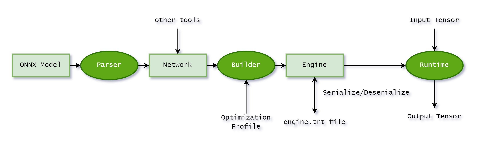

## 0. 前言

在部署深度学习模型时需要用到TensorRT，看了一遍文档后，我发现对于初学者来说，官方文档实在是太晦涩。文档里既没有接口的应用示例，也没有及时更新新接口的用法。在翻阅了部分博客和TensorRT仓库源码后，才有了本文。

TensorRT是NVIDIA推出的用于深度学习推理的高性能引擎，旨在优化深度神经网络模型的推理速度和性能。TensorRT可以通过层融合、混合精度、量化等技术显著提高深度神经网络的推理性能。


NVIDIA提供了TensorRT的C++和Python API，这里主要介绍Python API的一些用法。

## 1. TensorRT的安装

在安装TensorRT前，首先确保已经安装了CUDA和cuDNN。然后根据CUDA的版本在 [下载页面](https://developer.nvidia.com/nvidia-tensorrt-8x-download) 下载对应的TensorRT安装包。

不过貌似最新版本的TensorRT（8.6.1）支持从PyPI直接安装

```bash
pip install tensorrt
```

但是我只在Linux系统中安装成功了，Windows系统中安装失败，原因暂时不明。

### 1.1 Windows下的安装

Windows下需要使用Zip文件安装，根据 [文档中 Zip File Installation 章节](https://docs.nvidia.com/deeplearning/tensorrt/install-guide/index.html#installing-zip)，下载zip包后：

1. 将压缩包内文件解压后，复制到 `C:\Program Files\NVIDIA GPU Computing Toolkit\TensorRT\v8.x.x.x` 下。安装路径随意选择。
2. 配置环境变量，将 `<安装路径>/lib` 和 `<安装路径>/bin` 添加到环境变量中。
3. 安装python包，进入 `<安装路径>/python` 目录，执行如下命令：

    ```bash
    pip install tensorrt-8.x.x-cp3x-none-win_amd64.whl
    ```

### 1.2 Linux下的安装

Linux下的安装比较简单，根据 [文档中 Tar File Installation 章节](https://docs.nvidia.com/deeplearning/tensorrt/install-guide/index.html#installing-tar)，下载tar包后：

1. 解压tar包，进入解压后的目录。

    ```bash
    tar -xzvf TensorRT-8.x.x.x.Linux.x86_64-gnu.cuda-1x.x.tar.gz
    cd TensorRT-8.x.x.x
    ```

2. 添加环境变量

    ```bash
    vim ~/.bashrc
    export LD_LIBRARY_PATH=$LD_LIBRARY_PATH:<安装路径>/lib
    export PATH=$PATH:<安装路径>/bin
    source ~/.bashrc
    ```

3. 安装python包

    ```bash
    cd TensorRT-8.x.x.x/python
    pip install tensorrt-8.x.x.x-cp3x-none-linux_x86_64.whl
    ```

## 2. 推理前的准备

TensorRT有自己的一套推理流程，我们在使用PyTorch或TensorFlow导出模型权重后，需要进一步转换。

TensorRT最终需要的是一个TensorRT Engine，这个Engine是由TensorRT的Builder构建，而Builder需要一个TensorRT Network。TensorRT Network是由TensorRT Parser解析的ONNX模型构建的。



当然，也有一些针对特定框架直接导出TensorRT Engine的工具，例如 [torch2trt](https://github.com/NVIDIA-AI-IOT/torch2trt)、 [TF-TRT](https://github.com/tensorflow/tensorrt) 等等，这里我用了更通用的方法，即先导出ONNX模型，再转换为TensorRT Engine。

我们还需要安装如下依赖，以备后续使用：

```bash
pip install onnx onnxruntime pycuda
```

### 2.1 导出ONNX模型

对于PyTorch模型，可以使用 [torch.onnx.export](https://pytorch.org/docs/stable/generated/torch.onnx.export.html) 导出ONNX模型。

```python
import torch
from model import Model

model = Model()
model.load_state_dict(torch.load('model.pth'))
model.eval()

dummy_input = torch.randn(1, 3, 224, 224)
torch.onnx.export(model, dummy_input, 'model.onnx', verbose=True)
```

对于TensorFlow模型，可以使用 [tf.saved_model.save](https://www.tensorflow.org/api_docs/python/tf/saved_model/save) 导出SavedModel，再使用 [tf2onnx](https://github.com/onnx/tensorflow-onnx) 将SavedModel转换为ONNX模型。

```python
import tensorflow as tf
import tf2onnx
import onnx
from model import Model

model = Model()
model.load_weights('model.h5')
model.compile()

input_signature = [tf.TensorSpec([3, 3], tf.float32, name='x')]
# Use from_function for tf functions
onnx_model, _ = tf2onnx.convert.from_keras(model, input_signature)
onnx.save(onnx_model, "dst/path/model.onnx")
```

### 2.2 转换为TensorRT Engine

为完成Engine的构建，我们需要完成的步骤有：

1. 转换并填充Network对象；
2. 编写构建配置对象（Config）；
3. 编写优化配置对象（Optimization Profile）；

TensorRT 默认为我们提供了三种主流格式的转换器：`UffParser`、`CaffeParser`、`OnnxParser`，在本文中我们需要使用`OnnxParser`。

TensorRT 支持两种批处理模式：显式批处理（explicit batch）和隐式批处理（implicit batch）。假设网络的输入张量形状为`(n, c, h, w)`，在隐式批处理模式下，网络只需要指定输入形状为`(c, h, w)`，批次维度是隐式的，并且在运行时可动态指定；在显式批处理模式下，批量维度需要网络显示定义，甚至可以不用批量维度，对于动态批量大小的需求，可以使用Optimization Profile配置动态形状。隐式批处理由早期TensorRT使用，现在已经被弃用了，许多教程中你会发现代码中出现了`builder.max_batch_size = 32`这样的调用，这就隐式批处理的相关配置，现在已经不赞成使用。

为开启显示批处理，需要：

```python
builder = trt.Builder(...)
builder.create_network(1 << int(trt.NetworkDefinitionCreationFlag.EXPLICIT_BATCH))
```

Optimization Profile支持配置网络输入的动态形状，比如动态批次大小、动态图像输入大小。为实现动态形状输入，我们需要指定输入张量的三个形状配置：最小尺寸、最优尺寸、最大尺寸。

```python
min_shape = (3, 100, 200)
opt_shape = (3, 150, 250)
max_shape = (3, 200, 300)
profile = builder.create_optimization_profile();
profile.set_shape("input", min_shape, opt_shape, max_shape) 
config.add_optimization_profile(profile)
```

TensorRT支持设置多个优化配置文件，在运行时，需要设置优化配置文件，默认隐式选择配置文件0。你可以通过以下接口手动更改当前优化配置，需要注意的是，一个Engine可以有多个Context，但一个优化配置文件只能有一个Context。
优化配置文件的使用还有许多细节需要留意，更多请参考[TensorRT文档 Working with Dynamic Shapes 章节](https://docs.nvidia.com/deeplearning/tensorrt/developer-guide/index.html#work_dynamic_shapes)

```python
context.set_optimization_profile_async(0, stream)
```

有了以上基础，我们可以编写一个函数，将ONNX模型转换为TensorRT Engine。

```python
import tensorrt as trt

TRT_LOGGER = trt.Logger(trt.Logger.INFO)

def GiB(val):
    return val * 1 << 30

# This function builds an engine from a onnx model.
def build_engine(onnx_file_path, precision = 'fp32', dynamic_shapes = None):
    """Takes an ONNX file and creates a TensorRT engine to run inference with"""

    EXPLICIT_BATCH_FLAG = 1 << int(trt.NetworkDefinitionCreationFlag.EXPLICIT_BATCH)

    builder = trt.Builder(TRT_LOGGER)
    network = builder.create_network(EXPLICIT_BATCH_FLAG)
    config = builder.create_builder_config()
    parser = trt.OnnxParser(network, TRT_LOGGER)

    # Parse model file
    TRT_LOGGER.log(TRT_LOGGER.INFO, f'Loading ONNX file from path {onnx_file_path}...')
    with open(onnx_file_path, 'rb') as model:
        TRT_LOGGER.log(TRT_LOGGER.INFO, 'Beginning ONNX file parsing')
        if not parser.parse(model.read()):
            for error in range(parser.num_errors):
                TRT_LOGGER.log(TRT_LOGGER.ERROR, parser.get_error(error))
            raise ValueError('Failed to parse the ONNX file.')
    TRT_LOGGER.log(TRT_LOGGER.INFO, 'Completed parsing of ONNX file')
    TRT_LOGGER.log(TRT_LOGGER.INFO, f'Input number: {network.num_inputs}')
    TRT_LOGGER.log(TRT_LOGGER.INFO, f'Output number: {network.num_outputs}')
    
    
    if dynamic_shapes is not None:
        # set optimization profile for dynamic shape
        profile = builder.create_optimization_profile()
        for i in range(network.num_inputs):
            input = network.get_input(i)
            min_shape = dynamic_shapes['min_shape']
            opt_shape = dynamic_shapes['opt_shape']
            max_shape = dynamic_shapes['max_shape']
            profile.set_shape(input.name, min_shape, opt_shape, max_shape)
        config.add_optimization_profile(profile)

    # We set the builder batch size to be the same as the calibrator's, as we use the same batches
    # during inference. Note that this is not required in general, and inference batch size is
    # independent of calibration batch size.
    config.set_memory_pool_limit(trt.MemoryPoolType.WORKSPACE, GiB(1)) # 1G
    
    if precision == 'fp32':
        pass
    elif precision == 'fp16':
        config.set_flag(trt.BuilderFlag.FP16)
    elif precision == 'int8':
        config.set_flag(trt.BuilderFlag.INT8)
    else:
        raise ValueError('precision must be one of fp32, fp16, or int8')

    # Build engine.
    TRT_LOGGER.log(TRT_LOGGER.INFO, f'Building an engine from file {onnx_file_path}; this may take a while...')
    serialized_engine = builder.build_serialized_network(network, config)
    TRT_LOGGER.log(TRT_LOGGER.INFO, 'Completed creating Engine')
    return serialized_engine
```

### 3.3 保存TensorRT Engine

序列化和反序列化TensorRT Engine的代码如下：

```python
def save_engine(engine, path):
    TRT_LOGGER.log(TRT_LOGGER.INFO, f'Saving engine to file {path}')
    path = Path(path)
    path.parent.mkdir(parents=True, exist_ok=True)
    with open(path, 'wb') as f:
        f.write(engine)
    TRT_LOGGER.log(TRT_LOGGER.INFO, 'Completed saving engine')

def load_engine(path):
    logger.info(f'Loading engine from file {path}')
    runtime = trt.Runtime(logger.TRT_LOGGER)
    with open(path, 'rb') as f:
        engine = runtime.deserialize_cuda_engine(f.read())
    logger.info('Completed loading engine')
    return engine
```

## 3. 使用TensorRT进行推理

上文中提到了网络输入张量支持动态形状，同样的，输出张量也支持动态形状，比如网络输出形状由网络输入形状决定，为此，我们需要编写一些分配内存的策略。
在内存分配上，我们需要一点CUDA编程相关的知识，具体来说，使用pycuda分配内存（实际上更建议使用cudart）。在CUDA内存模型中，Host指电脑主机，Device指NVIDIA显卡。

我们需要派生`IOutputAllocator`类，然后实现自己的`reallocate_output`和`notify_shape`方法。`reallocate_output`中可以实现的内存分配方案很灵活，这里使用的是每次都重新申请内存，显然这样是不优的，这样做的好处是代码量少，另一些可选的方案有：

1. 预分配足够大的内存，可以使用`context.get_max_output_size(output_tensor_name)`来获取优化配置文件中的最大**字节数**；
2. 重新利用上一次分配的内存空间，仅当空间不足时才重新分配；
3. ......

```python
from collections import OrderedDict
import tensorrt as trt
import pycuda.driver as cuda
import numpy as np

class OutputAllocator(trt.IOutputAllocator):
    def __init__(self):
        # print("[MyOutputAllocator::__init__]")
        super().__init__()
        self.buffers = {}
        self.shapes = {}

    def reallocate_output(self, tensor_name: str, memory: int, size: int, alignment: int) -> int:
        # print("[MyOutputAllocator::reallocate_output] TensorName=%s, Memory=%s, Size=%d, Alignment=%d" % (tensor_name, memory, size, alignment))
        if tensor_name in self.buffers:
            del self.buffers[tensor_name]
        
        address = cuda.mem_alloc(size)
        self.buffers[tensor_name] = address
        return int(address)
        
    def notify_shape(self, tensor_name: str, shape: trt.Dims):
        # print("[MyOutputAllocator::notify_shape] TensorName=%s, Shape=%s" % (tensor_name, shape))
        self.shapes[tensor_name] = tuple(shape)
```

然后封装一个用于推理的类，该类提供一个 `infer` 接口，接收一个输入列表或字典，返回一个输出字典。列表和字典的值是numpy数组。当输入为列表时，列表中的元素将按顺序传入模型。为了顺利执行推理，我们需要在推理前将输入张量从host转移到device上，在推理后将输出张量从device转移到host上。基于index的张量方法已经被弃用，在新版本TensorRT中建议使用基于name的张量方法。

以下代码使用了异步方法，需要用到cuda stream，关于cuda stream的概念和用法，可以参考[CUDA文档 Streams 章节](https://docs.nvidia.com/cuda/cuda-c-programming-guide/index.html#streams)

```python
from collections import OrderedDict
from typing import Dict, OrderedDict, List, Union
import tensorrt as trt
import numpy as np
import pycuda.driver as cuda
import pycuda.autoinit

def get_input_tensor_names(engine: trt.ICudaEngine) -> list[str]:
    input_tensor_names = []
    for binding in engine:
        if engine.get_tensor_mode(binding) == trt.TensorIOMode.INPUT:
            input_tensor_names.append(binding)
    return input_tensor_names

def get_output_tensor_names(engine: trt.ICudaEngine) -> list[str]:
    output_tensor_names = []
    for binding in engine:
        if engine.get_tensor_mode(binding) == trt.TensorIOMode.OUTPUT:
            output_tensor_names.append(binding)
    return output_tensor_names

class ProcessorV3:
    def __init__(self, engine: trt.ICudaEngine):
        # # 选择第一个可用的 GPU 设备
        # device = cuda.Device(0)
        # # 将所选设备设置为当前活动的上下文
        # self.cuda_context = device.make_context()
        # self.cuda_context.push()
        
        self.engine = engine
        self.output_allocator = OutputAllocator()
        # create execution context
        self.context = engine.create_execution_context()
        # get input and output tensor names
        self.input_tensor_names = get_input_tensor_names(engine)
        self.output_tensor_names = get_output_tensor_names(engine)
        # create stream
        self.stream = cuda.Stream()
        # Create a CUDA events
        self.start_event = cuda.Event()
        self.end_event = cuda.Event()
        
    # def __del__(self):
    #     self.cuda_context.pop()
        
    def get_last_inference_time(self):
        return self.start_event.time_till(self.end_event)
        
    def infer(self, inputs: Union[Dict[str, np.ndarray], List[np.ndarray], np.ndarray]) -> OrderedDict[str, np.ndarray]:
        """
        inference process:
        1. create execution context
        2. set input shapes
        3. allocate memory
        4. copy input data to device
        5. run inference on device
        6. copy output data to host and reshape
        """
        # set input shapes, the output shapes are inferred automatically

        if isinstance(inputs, np.ndarray):
            inputs = [inputs]
        if isinstance(inputs, dict):
            inputs = [inp if name in self.input_tensor_names else None for (name, inp) in inputs.items()]
        if isinstance(inputs, list):
            for name, arr in zip(self.input_tensor_names, inputs):
                self.context.set_input_shape(name, arr.shape)

        buffers_host = []
        buffers_device = []
        # copy input data to device
        for name, arr in zip(self.input_tensor_names, inputs):
            host = cuda.pagelocked_empty(arr.shape, dtype=trt.nptype(self.engine.get_tensor_dtype(name)))
            device = cuda.mem_alloc(arr.nbytes)
            
            host[:] = arr
            cuda.memcpy_htod_async(device, host, self.stream)
            buffers_host.append(host)
            buffers_device.append(device)
        # set input tensor address
        for name, buffer in zip(self.input_tensor_names, buffers_device):
            self.context.set_tensor_address(name, int(buffer))
        # set output tensor allocator
        for name in self.output_tensor_names:
            self.context.set_tensor_address(name, 0) # set nullptr
            self.context.set_output_allocator(name, self.output_allocator)
        # The do_inference function will return a list of outputs
        
        # Record the start event
        self.start_event.record(self.stream)
        # Run inference.
        self.context.execute_async_v3(stream_handle=self.stream.handle)
        # Record the end event
        self.end_event.record(self.stream)

        # self.memory.copy_to_host()
        
        output_buffers = OrderedDict()
        for name in self.output_tensor_names:
            arr = cuda.pagelocked_empty(self.output_allocator.shapes[name], dtype=trt.nptype(self.engine.get_tensor_dtype(name)))
            cuda.memcpy_dtoh_async(arr, self.output_allocator.buffers[name], stream=self.stream)
            output_buffers[name] = arr
        
        # Synchronize the stream
        self.stream.synchronize()
        
        return output_buffers
```

使用示例：

```python
inputs = {
  'image': np.array(...),
}

engine = load_engine(...)
processor = ProcessorV3(engine)

outputs = processor.infer(inputs)
```

## 4. 后记

有一个需要注意的地方，TensorRT生成的Engine是和硬件相关的，不同型号的显卡不能通用这个Engine。

当然，如果只是按照前文这种用法的话，体现不出使用TensorRT的优势。TensorRT的另一个功能是低精度推理，支持模型量化，但这又是另一个体系庞大的故事了，这里先挖一个坑，以后慢慢填。

还有一点待优化的是，CUDA是支持多个Stream并行执行的，但是上述代码并没有体现这一点，这个作为CUDA编程的一个坑，先留一下。

## 5. 参考资料

1. [NVIDIA 开发者手册](https://docs.nvidia.com/deeplearning/tensorrt/index.html)
2. [NVIDIA TensorRT 中文版开发手册](https://github.com/HeKun-NVIDIA/TensorRT-Developer_Guide_in_Chinese)
3. [TensorRT Python API文档](https://docs.nvidia.com/deeplearning/tensorrt/api/python_api/index.html)
4. [TensorRT C++ API文档](https://docs.nvidia.com/deeplearning/tensorrt/api/c_api/index.html)
5. [TensorRT 的介绍与应用](https://dataxujing.github.io/TensorRT_CV/index.htm)
6. [PyCUDA 文档](https://documen.tician.de/pycuda/)
7. [CUDA C++ Programming Guide](https://docs.nvidia.com/cuda/cuda-c-programming-guide/index.html)
8. [CUDA Python Manual](https://nvidia.github.io/cuda-python/)
9. ["CUDA Stream" from Lei Mao's blog](https://leimao.github.io/blog/CUDA-Stream/)
10. ["Page-Locked Host Memory for Data Transfer" from Lei Mao's blog](https://leimao.github.io/blog/Page-Locked-Host-Memory-Data-Transfer/)
